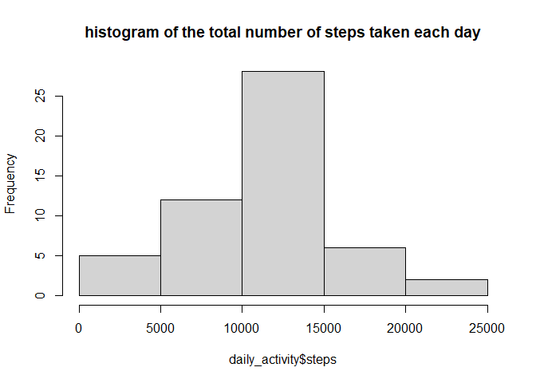
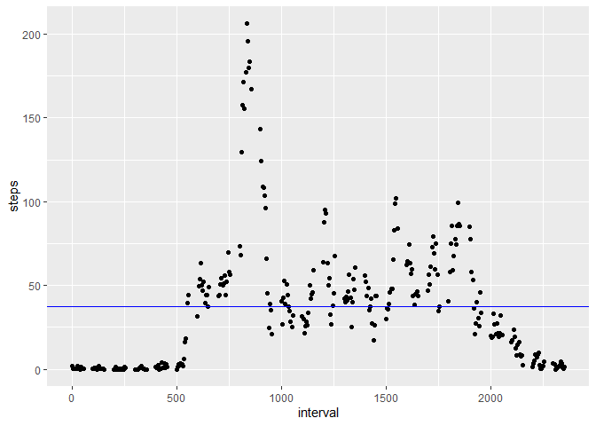
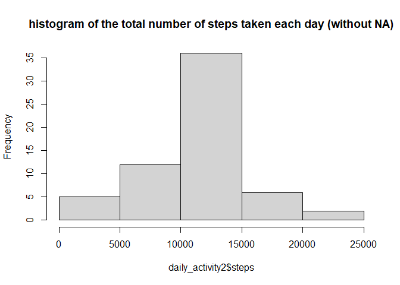
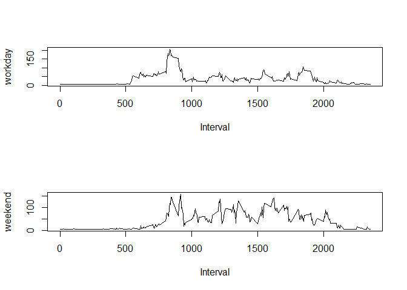

## Loading and preprocessing the data

```r
activity <- read.csv("activity.csv", sep = ",")
```


## What is mean total number of steps taken per day?

```r
daily_activity<-aggregate(steps~date, data = activity, na.rm = T, sum)
hist(daily_activity$steps, main = "histogram of the total number of steps taken each day")
```

<!-- -->


Calculate and report the mean and median total number of steps taken per day

Median = 10765 and Mean = 1.0766189\times 10^{4}

## What is the average daily activity pattern?

Time series plot of the 5-minute interval (x-axis) and the average number of steps taken, averaged across all days (y-axis)


```r
stepsByDayAvg <- aggregate(steps~interval, data= activity, na.rm= T, mean)
library(ggplot2)
```

```
## Warning: package 'ggplot2' was built under R version 4.0.2
```

```r
ggplot(stepsByDayAvg, aes(interval, steps)) + geom_point(na.rm = T) + geom_hline(yintercept = mean(stepsByDayAvg$steps), color="blue")
```

<!-- -->

Which 5-minute interval, on average across all the days in the dataset, contains the maximum number of steps?


```r
max <- which.max(stepsByDayAvg$steps)
```

Max number of steps: 206.1698113
Interval: 835 


## Imputing missing values


```r
sum(is.na(activity$steps))
```

```
## [1] 2304
```

1. The number of missing values 2304

2. I use the mean for all NA values

3. Create a new dataset that is equal to the original dataset but with the missing data filled in.

```r
activity2 <- activity
activity2$steps[is.na(activity2$steps)] <- mean(activity2$steps, na.rm=T)
daily_activity2<-aggregate(steps~date, data = activity2, na.rm = T, sum)
```
4. Make a histogram of the total number of steps taken each day and Calculate and report the mean and median total number of steps taken per day

```r
hist(daily_activity2$steps, main = "histogram of the total number of steps taken each day (without NA)")
```

<!-- -->

Median = 1.0766189\times 10^{4} and Mean = 1.0766189\times 10^{4}

Do these values differ from the estimates from the first part of the assignment? What is the impact of imputing missing data on the estimates of the total daily number of steps?

The difference is little. Since the values were replaced with the mean value and these were equivalent to 13%, the results were homogenized at these values.


## Are there differences in activity patterns between weekdays and weekends?

1. Create a new factor variable in the dataset with two levels -- "weekday" and "weekend" indicating whether a given date is a weekday or weekend day.


```r
library(dplyr)
```

```
## Warning: package 'dplyr' was built under R version 4.0.2
```

```
## 
## Attaching package: 'dplyr'
```

```
## The following objects are masked from 'package:stats':
## 
##     filter, lag
```

```
## The following objects are masked from 'package:base':
## 
##     intersect, setdiff, setequal, union
```

```r
activity2 <- activity2 %>% mutate(workingDays=(as.POSIXlt(date)$wday>0 & as.POSIXlt(date)$wday<6))
intervalByWeekAvg <- aggregate(steps~interval+workingDays, data = activity2, mean)
```

2. Make a panel plot containing a time series plot (i.e. type = "l") of the 5-minute interval (x-axis) and the average number of steps taken, averaged across all weekday days or weekend days (y-axis). 

```r
par(mfrow=c(2,1))
plot(type="l", x=intervalByWeekAvg$interval[intervalByWeekAvg$working], y=intervalByWeekAvg$steps[intervalByWeekAvg$working],xlab="Interval",ylab="workday") 
plot(type="l", x=intervalByWeekAvg$interval[!intervalByWeekAvg$working], y=intervalByWeekAvg$steps[!intervalByWeekAvg$working],xlab="Interval",ylab="weekend")
```

<!-- -->


#End document
